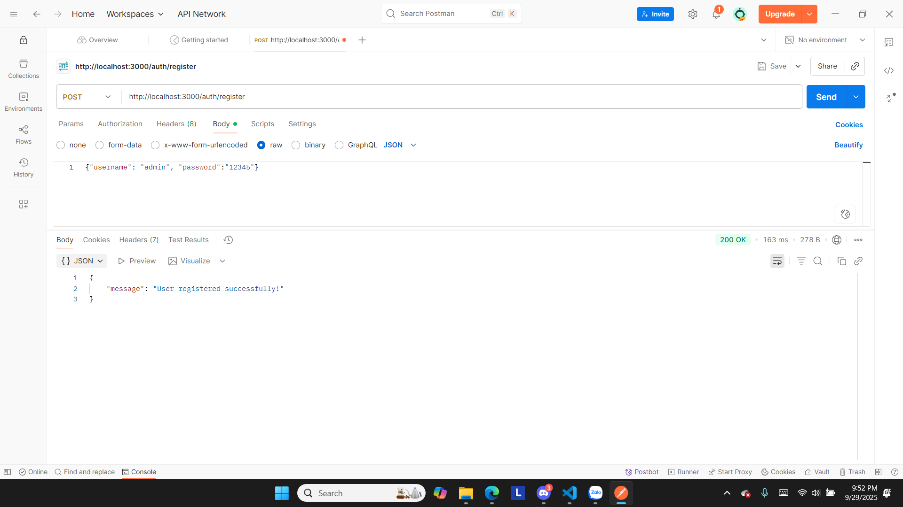

# cookie_session_auth
# a. node cookie_auth.js 

# b. Thực hiện đăng ký tài khoản với username và password

# Kiểm tra collection "users" trong CSDL MongoDB có dữ liệu thông tin đăng ký của người dùng

# Kiểm tra collection "session" trong CSDL MongoDB có dữ liệu thông tin session

# c. Thực hiện đăng nhập với tài khoản usernamr và password

# Kiểm tra collection "session" trong CSDL MongoDB có dữ liệu thông tin session

# d. Truy cập vào đường dẫn xem thông tin profile

# e. Thực hiện Đăng xuất khỏi tài khoản

# Đăng xuất thành công session đã bị xóa khỏi database
